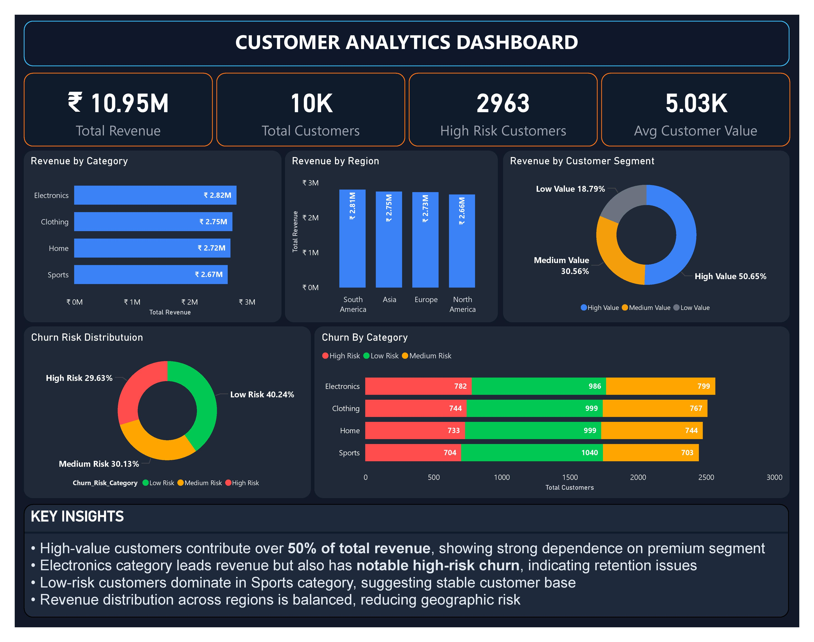

📊 Customer Revenue & Churn Analysis Dashboard (Power BI)

🔍 Overview
- This dashboard helps businesses identify revenue-driving customer segments and detect churn risks early to improve retention and profitability. This project analyzes customer revenue patterns and churn risk to identify high-value segments, uncover retention issues, and support data-driven decision-making.

📌 Project Type
- End-to-End Data Analytics Dashboard Project

📁 Dataset
- File: sales_and_customer_insights.csv
- Contains customer transactions, segmentation, regional data, and churn risk categories

🛠 Tools Used
- Power BI
- Excel

🧠 Skills Demonstrated
- Data Cleaning & Transformation
- Data Modeling
- DAX Calculations
- Data Visualization & Dashboard Design
- Business Insight Generation

📈 Key Insights
- High-value customers contribute over 50% of total revenue, indicating strong revenue concentration and dependency risk
- Electronics category generates the highest revenue but also shows elevated churn risk, signaling retention concerns
- Sports category has a higher proportion of low-risk customers, indicating a stable and loyal customer base
- Revenue distribution across regions is relatively balanced, reducing geographic dependency

💡 Business Recommendations
- Prioritize retention strategies for high-value customers to protect core revenue streams
- Investigate churn drivers in the Electronics category and implement targeted interventions
- Leverage low-risk segments (Sports category) for consistent and predictable growth
- Maintain diversified regional strategies to minimize market-specific risks

📊 Dashboard Preview

This project demonstrates the ability to transform raw data into actionable business insights using Power BI.
